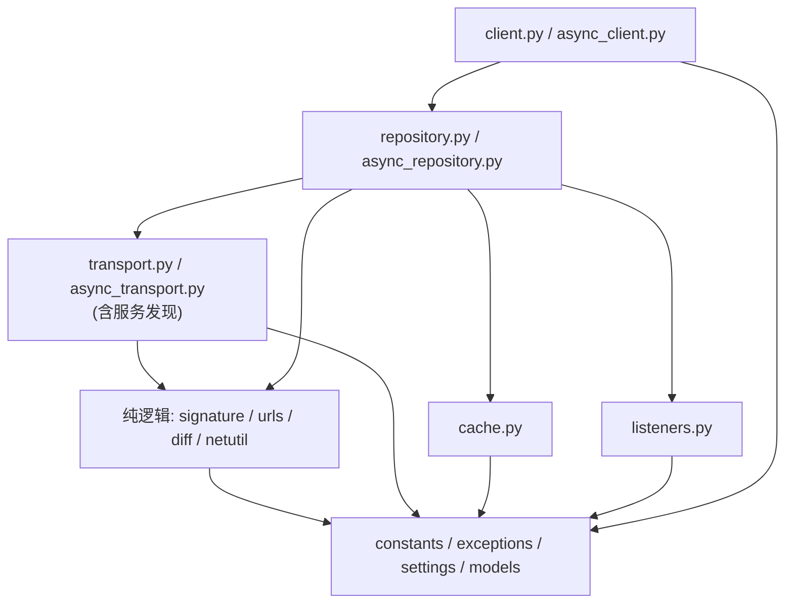
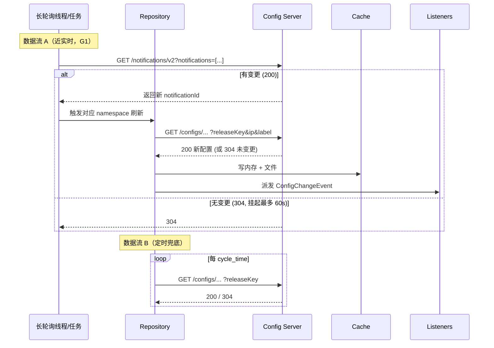

# pyapollo 改造方案文档

> 版本：Draft v2
> 适用仓库：`pyapollo/`（PyPI 包名 `shebao-apollo-sdk`，import 名 `pyapollo`）
> 目标版本：`1.0.0`（**允许破坏性变更、不保留兼容层**，仅提供迁移指南）
>
> 已确认的关键决策（见文末「已确认决策」）：
> - 目标版本 **1.0.0**，不保留向后兼容 shim（无 `_compat`、无弃用别名）
> - 包布局迁移到 **`src/` 布局**
> - Python 最低版本 **3.12**（类型注解直接用内置泛型与 `X | None`，无需 `__future__`）
> - 分层**更扁平**：取消 `core/`、`discovery/` 等子包，改为平铺模块
> - 构造行为：保留 `autostart: bool = True` 作为**正式长期参数**（默认保持「构造即启动」的直觉，可显式关闭），不再是弃用过渡开关

---

## 1. 背景与目标

当前 `pyapollo` 是基于 Apollo 官方 HTTP API 的轻量 Python 客户端，基本可用，但与官方 Java 客户端相比，在**实时性、灰度发布、变更通知、线程安全、生命周期管理**上有明显差距，且 sync / async 两套实现存在大量重复代码。

本次改造目标：

| 编号 | 目标 | 优先级 |
|------|------|--------|
| G1 | 实现真正的 `/notifications/v2` 长轮询，实现近实时配置更新 | P0 |
| G2 | 修复同步单例 `__init__` 重复执行、重复起线程的 bug | P0 |
| G3 | 拉取配置时带 `ip` / `releaseKey` / `label`，补齐灰度发布与增量拉取（304） | P0 |
| G4 | 缓存分层重构：线程安全内存缓存 + 可插拔持久化缓存，默认目录合理 | P0 |
| G5 | 引入配置变更监听（`on_change` / listener）机制 | P1 |
| G6 | 构造与启动分离，提供清晰的生命周期 API（`start()` / `stop()` / 上下文管理器） | P1 |
| G7 | 消除 sync / async 重复代码，抽出无 IO 的纯逻辑层 | P1 |
| G8 | 增补类型化取值（`get_int` / `get_bool` / `get_float`），完善错误与就绪状态查询 | P2 |
| G9 | 完善单元测试（mock 化，不依赖真实 Apollo） | P2 |

**非目标（本次不做）**：

- 不实现 Apollo OpenAPI（配置写入 / 管理端能力），仅做客户端读取。
- 不引入重型依赖（如 pydantic 已用于 settings，其余保持轻量）。
- 不保留 `0.x` 的向后兼容 shim（本轮为 `1.0.0`，破坏性变更集中一次做完，通过迁移指南承接）。
- PyPI 包名定为 `shebao-apollo-sdk`，import 名 `pyapollo` 维持不变。

---

## 2. 现状问题回顾（精简）

| 问题 | 位置 | 影响 |
|------|------|------|
| 「长轮询」实为定时短轮询，未调用 `/notifications/v2` | `client._listener` | 实时性上限 = `cycle_time`（默认 30s） |
| `_notification_map` 初始化为 `-1` 后从未使用 | sync/async | 死代码，长轮询语义缺失 |
| 同步 `__new__` 做单例但 `__init__` 无防重入 | `client.__init__` | 重复拉配置 + 多个轮询线程泄漏 |
| 拉取 URL 未带 `ip` / `releaseKey` / `label` | `fetch_config_by_namespace` | 灰度发布失效、无法增量 |
| `get_value` 读缓存不加锁 | `client.get_value` | 与轮询线程存在读写竞态 |
| 默认缓存目录在包安装目录 `pyapollo/config/` | `_init_cache_file_dir_path` | 升级/多实例冲突、可能被清除 |
| namespace 名含 `_` 时 `split("_")[-1]` 解析错误 | `load_local_cache_file` | 带下划线的 namespace 缓存加载错乱 |
| sync/async 代码重复（签名、URL、update_config 等） | 全量 | 维护成本翻倍、易不一致 |
| 可变默认参数 `namespaces=["application"]` | `client.__init__` | Python 反模式 |
| 缓存/文件锁为类变量，跨实例共享 | `ApolloClient` 类属性 | 多客户端相互阻塞 |
| 无变更回调、无 `is_ready()` 状态 | 全量 | 调用方无法感知配置是否加载成功 |

---

## 3. 设计原则

1. **纯逻辑与 IO 分离**：所有无副作用的逻辑（签名、URL 组装、变更 diff、URL 解析、IP 获取）抽成纯函数模块（平铺，不放子包），sync 与 async 共享，杜绝重复。
2. **扁平优先、单一职责**：在「一层一个平铺模块」的前提下划分职责——传输+服务发现、仓库（拉取+长轮询）、缓存、监听、门面客户端。不为小 SDK 引入多层子包。
3. **可插拔**：缓存后端、传输层通过抽象基类注入，便于测试与扩展（如换 Redis 缓存）。
4. **显式生命周期**：构造仅装配、不触发网络与线程；由 `start()` / `async start()` / 上下文管理器控制。为保留旧直觉，提供 `autostart=True` 正式参数在构造末尾自动启动。
5. **一次性破坏、清晰迁移**：本轮 `1.0.0` 允许破坏公共 API，不保留兼容 shim；所有破坏点集中记录在「破坏性变更与迁移指南」（§7）。
6. **线程安全**：内存缓存读写加锁（sync 用 `RLock`，async 用 `asyncio.Lock`），实例级锁而非类级锁。
7. **日志用标准库**：全面改用标准库 `logging`，每个模块顶部声明 `logger = logging.getLogger(__name__)`，不再依赖 `loguru`。作为库（library），**不配置 handler、不设置 level、不调用 `basicConfig`**，把输出控制权交还给使用方；库内只负责产生日志。
8. **无异味、过静态检查**：所有代码必须通过统一的 lint / 类型检查 / 格式化门禁（见 §9.2），消除常见异味与潜在语法/逻辑 bug；CI 未通过不得合并。

---

## 4. 目标包结构

采用 **`src/` 布局**（G：包布局决策），import 名 `pyapollo` 不变。1.0 交付后按**领域分包**，根目录仅保留公共 API 入口，内部模块归入子包。

```text
pyapollo/                        # 仓库根
├── pyproject.toml
├── src/
│   └── pyapollo/                # 包（import pyapollo）
│       ├── __init__.py          # 公共 API 导出 + logging.NullHandler
│       │
│       ├── core/                # 纯逻辑（无 IO）
│       │   ├── backoff.py
│       │   ├── constants.py
│       │   ├── diff.py
│       │   ├── exceptions.py
│       │   ├── getters.py
│       │   ├── models.py
│       │   ├── netutil.py
│       │   ├── signature.py
│       │   └── urls.py
│       │
│       ├── config/              # 客户端配置
│       │   └── settings.py      # ApolloSettingsConfig
│       │
│       ├── cache/               # 内存 + 文件容灾缓存
│       │   └── store.py
│       │
│       ├── listeners/           # 变更监听注册表
│       │   └── registry.py
│       │
│       ├── transport/           # HTTP + 服务发现
│       │   ├── sync.py
│       │   └── async_.py
│       │
│       ├── repository/          # 拉取 + 长轮询 + 退避
│       │   ├── sync.py
│       │   └── async_.py
│       │
│       └── client/              # 对外门面
│           ├── sync.py          # ApolloClient
│           └── async_.py        # AsyncApolloClient
└── tests/
```

设计取舍说明：

- **`core/`**：签名、URL、diff、模型、类型化取值等纯逻辑，sync/async 共享。
- **`transport/` / `repository/` / `client/`**：同步与异步分文件，避免仅用同步客户端时导入 `aiohttp`。
- **删除 `interface.py` / `async_interface.py`**：未使用的抽象接口文件已移除；ABC 就近定义在 `transport/sync.py` 等模块内。
- **公共导入**：应用代码只用 `from pyapollo import ApolloClient, AsyncApolloClient, ...`；内部子包路径不保证稳定。

### 4.1 模块依赖方向（自底向上）



依赖只允许自下而上，禁止反向依赖，保证纯逻辑模块可独立单测。

---

## 5. 核心模块详细设计

### 5.1 `models.py` 数据模型（单文件）

```python
# models.py
@dataclass(frozen=True)
class ConfigResult:
    app_id: str
    cluster: str
    namespace: str
    configurations: dict[str, str]
    release_key: str | None

@dataclass(frozen=True)
class ServiceInstance:
    home_page_url: str      # e.g. http://host:8080
    instance_id: str | None = None
```

```python
# models.py
@dataclass
class Notification:
    namespace_name: str
    notification_id: int = -1      # 初始 -1，长轮询后由服务端回填
    messages: dict | None = None   # ApolloNotificationMessages
```

```python
# models.py
class ChangeType(enum.Enum):
    ADDED = "ADDED"
    MODIFIED = "MODIFIED"
    DELETED = "DELETED"

@dataclass(frozen=True)
class ConfigChange:
    namespace: str
    key: str
    old_value: str | None
    new_value: str | None
    change_type: ChangeType

@dataclass(frozen=True)
class ConfigChangeEvent:
    namespace: str
    changes: dict[str, ConfigChange]   # key -> change
```

### 5.2 纯逻辑模块（平铺，sync/async 共享，重点消重）

四个独立平铺模块，取代原 `core/` 子包：

```python
# signature.py
def sign(string_to_sign: str, secret: str) -> str: ...
def build_auth_headers(url: str, app_id: str, secret: str | None) -> dict[str, str]:
    """secret 为空时返回 {}。"""

# urls.py
def build_config_url(
    base: str, app_id: str, cluster: str, namespace: str,
    release_key: str | None, ip: str | None, label: str | None,
    messages: dict | None,
) -> str: ...

def build_notifications_url(
    base: str, app_id: str, cluster: str, notifications: list[Notification],
) -> str: ...

def parse_host_port(url: str) -> tuple[str, int]:
    """统一 host:port 解析，取代当前 sync/async 各写一份的脆弱逻辑。"""

# diff.py
def diff_config(namespace: str, old: dict, new: dict) -> ConfigChangeEvent:
    """计算 ADDED / MODIFIED / DELETED。"""

# netutil.py
def get_local_ip(explicit: str | None) -> str: ...
```

> 这些函数**无任何 IO / 全局状态**，可 100% 单测覆盖，sync 与 async 仓库都直接调用，从根本上消除重复。

### 5.3 `transport.py` / `async_transport.py`（传输层 + 服务发现）

传输与服务发现合并到同一层，同步一个文件、异步一个文件。

```python
# transport.py
class SyncTransport(ABC):
    @abstractmethod
    def get(self, url: str, headers: dict, timeout: float) -> HttpResult: ...
    @abstractmethod
    def close(self) -> None: ...

@dataclass
class HttpResult:
    status: int
    json_body: Any | None
    text: str | None

class RequestsTransport(SyncTransport):
    """基于 requests.Session（复用连接）。"""

class ConfigServiceLocator:
    """服务发现：封装 {meta}/services/config；支持自定义 config server 直连；
    内置服务列表缓存 + 失败切换（exclude 当前故障节点）。"""
    def get_services(self, exclude: str | None = None) -> list[ServiceInstance]: ...
```

- `async_transport.py`：对称的 `AsyncTransport(ABC)` / `AiohttpTransport` / `AsyncConfigServiceLocator`，基于 `aiohttp.ClientSession`。
- 统一超时、异常语义（连接失败 / 超时 → `ServerNotResponseException`），修复现状 sync/async 不一致、`get_service_conf` 无超时无鉴权的问题。
- 鉴权 Header 由 `signature.build_auth_headers` 生成后传入，传输层不关心签名细节；host:port 解析复用 `urls.parse_host_port`。

### 5.5 `cache.py` 缓存层（G4）

内存缓存与文件容灾缓存合并在单个模块：

```python
# cache.py
class ConfigCache(ABC):          # 内存缓存抽象
    def get(self, namespace: str) -> dict | None: ...
    def set(self, namespace: str, data: dict) -> None: ...
    def remove(self, namespace: str) -> None: ...
    def snapshot(self) -> dict[str, dict]: ...

class MemoryCache(ConfigCache):  # 线程安全内存缓存（RLock）

class FileCache:                 # 文件容灾缓存（同步；异步用 aiofiles 延迟 import）
    def load(self, namespace: str) -> dict | None: ...
    def save(self, namespace: str, data: dict, release_key: str | None) -> None: ...
    def load_all(self) -> dict[str, dict]: ...
```

关键改进：

1. **线程安全内存缓存**（`MemoryCache`）：读写都在 `RLock` 下（sync）；async 版用 `asyncio.Lock`。**修复当前 `get_value` 读不加锁的竞态（G4）。**
2. **持久化缓存 key 存储改进**：文件名从易解析歧义的 `{app_id}_configuration_{namespace}.txt` 改为**目录 + 元数据**：
   ```text
   {cache_dir}/{app_id}/{cluster}/{namespace}.json
   ```
   文件内容包含 `release_key` 元数据，避免 `split("_")` 歧义（**修复带下划线 namespace 的 bug**），且天然按 app/cluster 隔离。
3. **默认缓存目录合理化**：
   - 优先级：显式参数 > 环境变量 `APOLLO_CACHE_DIR` > 平台用户缓存目录（如 `~/.cache/apollo/` 或 `%LOCALAPPDATA%`）> `/opt/data/{app_id}`（对齐 Java 习惯）。
   - **不再默认写入包安装目录。**
4. **按 release_key 去重写盘**（保留现有优点），元数据随文件持久化，进程重启后可复用，避免无谓重写。
5. **不做旧文件名兼容**：`1.0.0` 直接采用新目录结构；旧 `0.x` 缓存文件失效（无害，下次拉取即重建），迁移指南中提示可删除旧目录。

### 5.6 `repository.py` / `async_repository.py` 配置仓库（核心，G1/G3）

职责：把「服务发现 + 拉取 + 长轮询 + 缓存写入 + 变更派发」编排起来。同步/异步各一文件，共享纯逻辑模块与数据模型。

```python
# repository.py（async_repository.py 结构对称）
class SyncRepository:
    notifications: dict[str, Notification]   # 取代死掉的 _notification_map
    backoff: ExponentialBackoff              # 失败退避（对齐 Java）
    def _apply_config(self, result: ConfigResult) -> ConfigChangeEvent | None:
        """写内存缓存 + 写文件缓存 + 计算 diff（复用 diff.diff_config）。"""
```

**两条数据流：**



要点：

- **长轮询**：`GET {config}/notifications/v2`，`notifications` 参数携带每个 namespace 的 `notificationId`，服务端挂起最长 ~60s；返回后更新 `notificationId` 并触发对应 namespace 的 `/configs` 拉取。**这才是真正的实时机制（G1），并让 `notifications` 状态真正发挥作用。**
- **拉取带参数**：`releaseKey`（增量/304）、`ip`（灰度）、`label`（灰度标签）、`messages`（长轮询回传）。**修复 G3。**
- **失败退避**：指数退避（如 1s → 上限 ~120s），对齐官方，避免故障时打爆服务端。
- **兜底定时刷新**：保留 `cycle_time` 作为长轮询之外的兜底。
- sync 版用 `threading.Thread`；async 版用 `asyncio.Task`。共享的纯逻辑（URL、diff、退避计算）走平铺模块，无需 `base.py`。

### 5.7 `listeners.py` 变更监听（G5）

```python
# listeners.py
ChangeCallback = Callable[[ConfigChangeEvent], None]

class ListenerRegistry:
    def add(self, callback: ChangeCallback, namespaces: set[str] | None = None,
            keys: set[str] | None = None) -> "Subscription": ...
    def dispatch(self, event: ConfigChangeEvent) -> None: ...
```

- 支持按 namespace / key 过滤。
- sync：回调在独立线程池派发，避免阻塞轮询线程。
- async：`await` 派发协程回调（同时兼容普通函数回调）。
- 异常隔离：单个 listener 抛错不影响其它 listener 与轮询。

### 5.8 `client.py` / `async_client.py` 门面（对外主入口，G6）

取值逻辑（`get_value` / `get_json_value` / `get_int` / `get_bool` / `get_float` / `get_list`）读缓存 snapshot，本身与 IO 无关。同步与异步取值语义一致，可用一个小的取值 mixin 复用，放在 `client.py` 内（异步版仅在需要 `await` 的方法上包一层）。

```python
# client.py
class ApolloClient:
    def __init__(self, ..., autostart: bool = True): ...  # 仅装配；autostart 时末尾调 start()
    def start(self) -> "ApolloClient": ...   # 首次拉取 + 启动长轮询
    def stop(self) -> None: ...
    def __enter__(self): return self.start()
    def __exit__(self, *exc): self.stop()

    def get_value(self, key, default=None, namespace="application"): ...
    def add_change_listener(self, cb, namespaces=None, keys=None): ...
    def is_ready(self) -> bool: ...          # 至少成功加载过一次（G8）
    def get_current_config(self) -> dict: ...
    def update_config(self, **kwargs) -> None:  # 内部委托各层
```

async 版对称：`await client.start()` / `async with AsyncApolloClient(...) as c`（异步版 `autostart` 仅影响是否在 `__aenter__` 自动启动，构造函数内不启协程）。

**生命周期变化（重要，见兼容策略）**：构造不再自动 `fetch + 起线程`。为兼容旧用法，提供 `autostart=True` 默认值（见 §7）。

### 5.9 日志规范（统一改用标准库 `logging`）

现状使用第三方 `loguru`（`from loguru import logger`）。作为一个被集成进他人项目的 **库**，直接引入并使用 `loguru` 的全局 logger 会侵入使用方的日志体系。本次统一改为标准库 `logging`。

**规范：**

1. 每个模块顶部固定写法，**不使用共享的全局 logger 对象**：
   ```python
   import logging

   logger = logging.getLogger(__name__)
   ```
   这样日志天然带上 `pyapollo.repository.sync_repository` 这类层级化名字，使用方可按前缀 `pyapollo` 统一控制。

2. **库不配置日志输出**：不添加 handler、不设 level、不调用 `logging.basicConfig()`。是否输出、输出到哪里、什么级别，全部由使用方决定。

3. **日志级别约定**：
   | 级别 | 使用场景 |
   |------|----------|
   | `DEBUG` | 长轮询 URL、notificationId 推进、命中缓存等排查细节 |
   | `INFO` | 客户端启动/停止、config server 切换、配置发生变更 |
   | `WARNING` | 单次请求失败但已降级（读本地缓存 / 切换节点） |
   | `ERROR` | 无法恢复的错误（如所有 config server 均不可用） |

4. **延迟格式化**：使用 `logger.debug("... %s", value)` 参数化写法，而非 f-string 预先拼接，避免未开启该级别时的无谓开销。

5. **异常日志**：在 `except` 中记录异常时使用 `logger.exception(...)` 或 `logger.error(..., exc_info=True)` 以保留堆栈。

6. **NullHandler**：在顶层 `src/pyapollo/__init__.py` 添加 `logging.getLogger("pyapollo").addHandler(logging.NullHandler())`，以消除使用方未配置日志时的 “No handlers could be found” 告警。此为库的推荐惯例，不违反「不配置输出」原则（NullHandler 不产生任何输出）。

> 影响面：涉及所有当前 `from loguru import logger` 的模块（`client.py` / `async_client.py` 等），改造中逐文件替换；`loguru` 从运行时依赖中移除（见附录 B）。

---

## 6. 关键机制改造对照表

| 机制 | 改造前 | 改造后 |
|------|--------|--------|
| 实时更新 | 定时 30s 全量短轮询 | `/notifications/v2` 长轮询 + 定时兜底（G1） |
| notification 状态 | `_notification_map` 死代码 | `repository.notifications` 真正驱动长轮询 |
| 单例 | `__new__` 单例 + `__init__` 重入 | 直接移除隐式单例（1.0 破坏性变更，G2） |
| 灰度 | URL 不带 ip/label | 带 `ip` / `label` / `releaseKey` / `messages`（G3） |
| 内存缓存 | 读不加锁 | 读写均加实例级锁（G4） |
| 文件缓存 | 包目录 + 易歧义文件名 | 用户缓存目录 + `{app}/{cluster}/{ns}.json` + 元数据（G4） |
| 变更通知 | 无 | listener 注册 + 事件派发（G5） |
| 生命周期 | 构造即副作用 | 构造/启动分离 + 上下文管理器（G6） |
| 代码复用 | sync/async 全量重复 | 纯逻辑抽平铺模块（signature/urls/diff/netutil），IO 分层（G7） |
| 日志 | 第三方 `loguru` 全局 logger | 标准库 `logging.getLogger(__name__)`，库不配置输出 |
| 取值类型 | value / json | + int / bool / float / list（G8） |
| 就绪状态 | 无 | `is_ready()`（G8） |

---

## 7. 公共 API 与破坏性变更 / 迁移指南

本轮为 `1.0.0`，**不保留兼容 shim**。以下明确「保持不变」与「破坏点」，并给出迁移写法。

### 7.1 保持不变的对外符号（尽量不折腾用户）

```python
from pyapollo import (
    ApolloClient, AsyncApolloClient, ApolloSettingsConfig,
    # 新增
    ConfigChangeEvent, ConfigChange, ChangeType,
)
```

- 顶层入口 `from pyapollo import ApolloClient` / `AsyncApolloClient` / `ApolloSettingsConfig` **保持可用**。
- 常用取值方法签名 `get_value` / `get_json_value` **保持不变**。
- `update_config(**kwargs)` / `get_current_config()` **保持不变**。

### 7.2 构造行为（`autostart` 正式参数，非过渡）

`autostart: bool = True` 作为**长期正式参数**：

- `True`（默认）：`__init__` 末尾自动 `start()`，保留旧「构造即可用」的直觉；相比 0.x 已修复重复起线程问题。
- `False`：仅装配，需显式 `client.start()`（推荐用于测试、需要延迟启动、或 DI 场景）。
- 异步客户端：`autostart` 只影响 `async with` 进入时是否自动启动，构造函数内不启协程。

> 与旧行为的差异：0.x 构造即拉配置+起线程且无法关闭；1.0 默认行为一致，但**可关闭**，且底层已修好单例重入 bug。

### 7.3 破坏性变更清单（`1.0.0`）

| 破坏点 | 0.x 行为 | 1.0 行为 | 迁移写法 |
|--------|----------|----------|----------|
| 隐式单例 | `ApolloClient(...)` 同参复用实例 | 每次构造都是独立实例 | 需共享时自行持有单个实例 / 用 DI 容器 |
| 内部模块路径 | `pyapollo.interface` / `pyapollo.async_interface` | 删除（抽象基类就近内嵌） | 不要 import 内部模块；只用 `from pyapollo import ...` |
| 生命周期方法名 | `stop_polling_thread()` / `stop_polling()` | 统一 `stop()`（同步）/ `await stop()`（异步） | 改调 `client.stop()` |
| 启动方式 | 构造即启动，不可控 | `start()` / 上下文管理器；`autostart=False` 可延迟 | 推荐 `with ApolloClient(...) as c:` |
| 缓存目录与文件名 | 包目录 `{app_id}_configuration_{ns}.txt` | 用户缓存目录 `{app}/{cluster}/{ns}.json` | 旧缓存无需迁移，下次拉取自动重建；可删旧目录 |
| 日志 | `loguru` 全局 logger | 标准库 `logging`，库不配置输出 | 使用方自行 `logging` 配置 `pyapollo` logger |
| 依赖 | 含 `loguru` | 移除 `loguru` | 无需操作 |
| Python 版本 | `>=3.7` | `>=3.12` | 升级运行环境到 3.12+ |

### 7.4 迁移示例

```python
# 0.x 写法
from pyapollo.client import ApolloClient
client = ApolloClient(meta_server_address=..., app_id=...)
val = client.get_value("k")
client.stop_polling_thread()

# 1.0 推荐写法
from pyapollo import ApolloClient
with ApolloClient(meta_server_address=..., app_id=...) as client:  # autostart 默认 True 也可
    val = client.get_value("k")
    client.add_change_listener(lambda e: print(e))   # 新能力
# 退出 with 自动 stop()
```

---

## 8. 分阶段实施计划

> 每个阶段独立可测、可合并，避免一次性大爆炸重构。

**每阶段完成定义（DoD，统一适用）**：新增/改动代码带类型注解与单测；本地与 CI 上 `ruff check`、`ruff format --check`、`mypy --strict`、`pytest` 全部通过（§9.2），无新增异味/告警；阶段 0 起即接入 `pre-commit` 与 CI 门禁，后续阶段不得引入回退。

### 阶段 0：`src/` 布局迁移 + 脚手架 + 纯逻辑模块
- 将包迁移到 `src/pyapollo/`，同步改 `pyproject.toml`（`[tool.setuptools.packages.find] where=["src"]`），移到 `>=3.12`，移除 `loguru`。
- 建 `models.py`、`constants.py`，扩充 `exceptions.py`。
- 抽纯逻辑平铺模块：`signature.py` / `urls.py` / `diff.py` / `netutil.py`；现有 client 改为调用它们（行为不变）。
- 补纯逻辑模块全量单测。
- 搭建质量门禁：在 `pyproject.toml` 配置 `ruff` / `mypy` / `pytest` / `coverage`，加 `pre-commit` 与 CI 工作流（§9.2）；顺带清理现存异味（可变默认参数、`except BaseException`、死代码等）。

### 阶段 1：传输层 + 服务发现
- 实现 `transport.py` / `async_transport.py`（HTTP + `ConfigServiceLocator` 合并），client 改为依赖注入。
- 统一超时/异常/鉴权路径（修复 async/sync 不一致、`get_service_conf` 无超时无鉴权问题）。

### 阶段 2：缓存层重构（G4）
- 实现 `cache.py`：`MemoryCache`（加锁）+ `FileCache`（新目录结构 + 元数据）。
- 默认目录改为用户缓存目录；**不做旧文件名兼容**（1.0 破坏）。
- 修复带下划线 namespace 的解析 bug、读写竞态。

### 阶段 3：仓库 + 长轮询（G1/G3，核心）
- 实现 `repository.py` / `async_repository.py`：`/notifications/v2` 长轮询 + 带参 `/configs` 拉取 + 指数退避 + 定时兜底。
- 让 `notifications` 状态真正驱动刷新。

### 阶段 4：变更监听（G5）
- 实现 `listeners.py`，仓库在 `_apply_config` 后派发事件。
- client 暴露 `add_change_listener`。

### 阶段 5：门面重构 + 生命周期（G6/G2/G7）
- 重写 `client.py` / `async_client.py`，构造/启动分离，`autostart` 正式参数。
- **移除隐式单例 `__new__`**，去类级锁（改实例级）。
- 统一停止方法为 `stop()`；补类型化取值与 `is_ready()`（G8）。

### 阶段 6：文档、示例、测试收尾（G9）✅
- 更新 `README` / `README.en` / `examples/`，删除旧 API 用法。
- 补集成测试（mock server）、并发测试、覆盖率门槛。
- 版本号 `1.0.0`，撰写 CHANGELOG 与迁移指南（对应 §7）。

---

## 9. 质量保障（测试 + 静态检查，G9）

### 9.1 测试策略

| 层 | 测试方式 |
|----|----------|
| 纯逻辑（signature/urls/diff/netutil） | 纯单测，无 mock，高覆盖（签名、URL、diff、解析边界含下划线 namespace） |
| `transport` / `async_transport`（含服务发现） | mock `requests` / `aiohttp`（`responses` / `aioresponses`），含空列表 / 故障切换 |
| `cache` | tmp 目录读写、并发读写压测、新目录结构 |
| `repository` / `async_repository` | mock 长轮询 200/304/超时，验证 notificationId 推进、退避、变更派发 |
| `client` / `async_client` | 端到端（mock server），验证生命周期、autostart、listener、is_ready |
| 并发 | 多线程读 + 轮询写，断言无竞态、无异常 |

引入 `pytest`、`pytest-asyncio`、`responses`/`aioresponses` 为 dev 依赖。

### 9.2 静态检查与代码质量门禁（消除异味 / 语法 bug）

统一工具链，**所有提交必须全绿**，作为 CI 合并门禁（对应设计原则 8）：

| 工具 | 职责 | 门禁要求 |
|------|------|----------|
| **Ruff**（lint） | 语法错误、未使用变量/导入、可变默认参数（`B006`）、裸 `except`、遮蔽内置名、f-string 无占位符等**异味与 bug**检测 | `ruff check` 零告警 |
| **Ruff**（format）或 Black | 统一代码风格 | `ruff format --check` 无 diff |
| **mypy**（`--strict`） | 静态类型检查，杜绝 `None` 误用、类型不匹配、缺失返回等**逻辑 bug** | 类型检查零错误 |
| **pytest + coverage** | 单测 + 覆盖率 | 纯逻辑模块覆盖率 ≥ 90%，整体 ≥ 80% |

重点关注、必须清零的**异味 / 潜在 bug**（现状代码中已存在，改造中一并根除）：

1. **可变默认参数**：`namespaces: List[str] = ["application"]` → 改 `None` 哨兵（Ruff `B006`）。
2. **裸 `except` / `except BaseException`**：`_get_local_ip_address` 捕获 `BaseException` 会吞掉 `KeyboardInterrupt` → 收窄为 `Exception` 或具体异常。
3. **宽泛 `except Exception` 后静默吞异常**：仓库/缓存里需保留日志（`logger.exception`）并让必要错误可感知。
4. **未使用的变量 / 死代码**：如 `_notification_map`、`_env`、`ip` 存而不用 → 要么接入逻辑，要么删除。
5. **共享可变状态**：类级 `_instances` / 类级锁 → 实例级；避免跨实例串扰。
6. **字符串解析脆弱点**：`split(":")` / `split("_")[-1]` → 用 `urllib.parse` 与结构化文件名，加边界单测。
7. **f-string 无占位、日志预格式化**：日志改参数化 `logger.debug("%s", x)`（见 §5.9）。
8. **类型注解完整**：公共 API 全部带类型标注，满足 mypy `--strict`（无隐式 `Any`、无缺失返回类型）。

配置集中在 `pyproject.toml`（`[tool.ruff]` / `[tool.mypy]` / `[tool.pytest.ini_options]` / `[tool.coverage]`），并提供 `pre-commit` 钩子在本地拦截。CI 顺序：`ruff check` → `ruff format --check` → `mypy` → `pytest`。

---

## 10. 风险与取舍

| 风险 | 说明 | 应对 |
|------|------|------|
| 破坏现有用户 | 1.0 移除单例、内部模块、改停止方法名 | 破坏点集中记录在 §7 迁移指南；顶层入口与取值方法尽量保持不变；`autostart=True` 保住构造直觉 |
| 长轮询实现复杂度 | 挂起连接、超时、退避、多 namespace | 参考 Java `RemoteConfigLongPollService`，阶段 3 单独交付并重点测试 |
| 平铺模块过多 | 无子包但文件数增加 | 以「消重 + 可测 + 按需 import」为准绳；同步/异步分文件避免误引 `aiohttp` |
| async 文件 IO | `aiofiles` | 在 `cache.py` 内延迟 import，同步路径不受影响 |
| 版本管理 | import 名与 PyPI 名不一致易困惑 | 文档明确；本次不改名（避免再引破坏） |

---

## 附录 A：`src/` 布局（本轮采用）

由 flat 布局（`pyapollo/pyapollo/`）迁移到 `pyapollo/src/pyapollo/`，避免「本地目录被误当包导入」、规范测试隔离。`pyproject.toml` 相应调整：

```toml
[tool.setuptools.packages.find]
where = ["src"]

[project]
requires-python = ">=3.12"
```

同步移动 `.py` 源码到 `src/pyapollo/`，`tests/` 保持在仓库根、以安装后的包（editable install）导入被测模块。

## 附录 B：依赖调整预览

- 运行时：`requests` / `aiohttp` / `aiofiles` / `pydantic-settings`（维持）。
- **移除**：`loguru`（改用标准库 `logging`，见 §5.9），同步删除 `pyproject.toml` / `requirements.txt` 中的依赖声明。
- 开发：新增 `pytest` / `pytest-asyncio` / `responses` / `aioresponses` / `coverage`；静态检查 `ruff` / `mypy` / `pre-commit`（见 §9.2）。
- Python：`>=3.12`。可直接使用内置泛型（`list[str]`、`dict[str, str]`）与 `X | None` 联合类型注解，**无需 `from __future__ import annotations`**；`asyncio` 直接用 `asyncio.get_running_loop()`、`asyncio.TaskGroup` 等新式 API，移除现有针对 3.7 的回退代码。

---

## 已确认决策

| # | 议题 | 决策 |
|---|------|------|
| 1 | 构造行为兼容力度 | 保留 `autostart: bool = True` 作为**正式长期参数**（默认保持「构造即启动」直觉，可显式关闭），非弃用过渡开关 |
| 2 | 目标版本 | **`1.0.0`**，允许破坏性变更、不保留兼容层（无 `_compat`、无弃用别名），仅提供迁移指南（§7） |
| 3 | 包布局 | 迁移到 **`src/` 布局**（附录 A） |
| 4 | Python 最低版本 | **`>=3.12`**（附录 B） |
| 5 | 分层粒度 | **更扁平**：取消 `core/`（纯逻辑拆平铺模块）、`discovery/` 合入 `transport`、`cache/` 与 `models/` 各合单文件、删 `_compat.py`（§4） |
